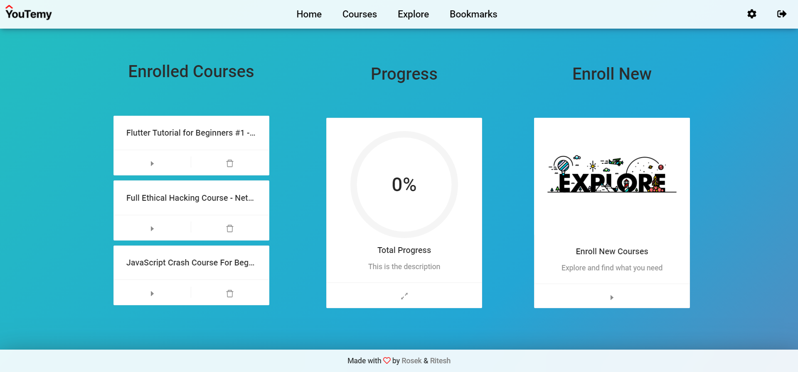
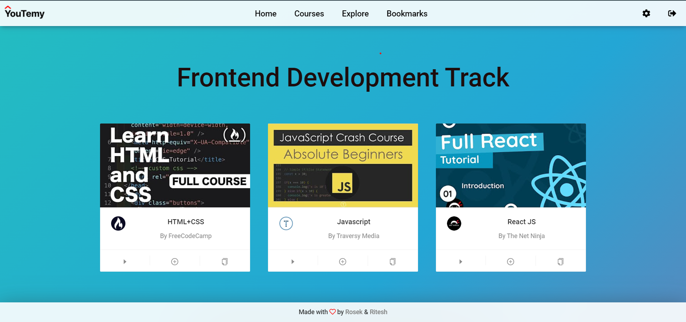
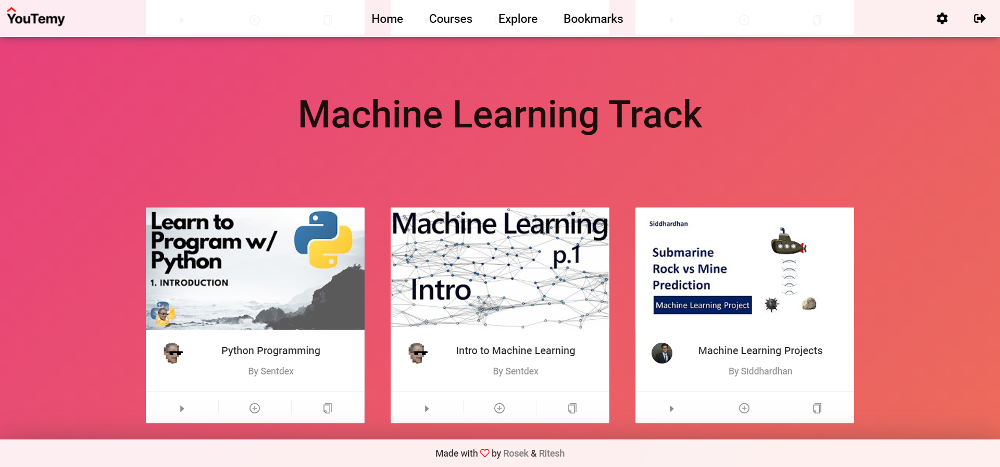
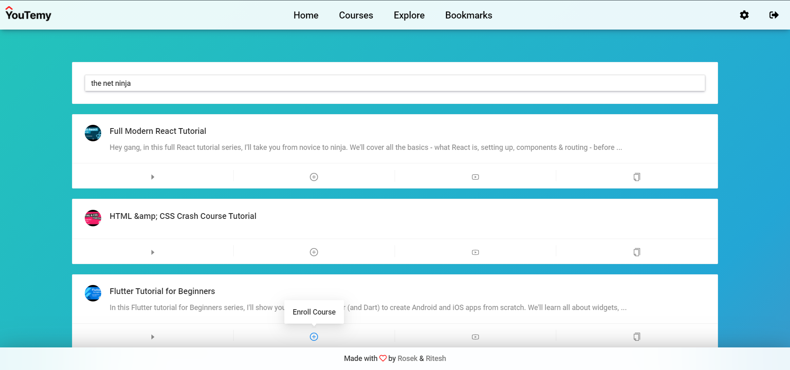
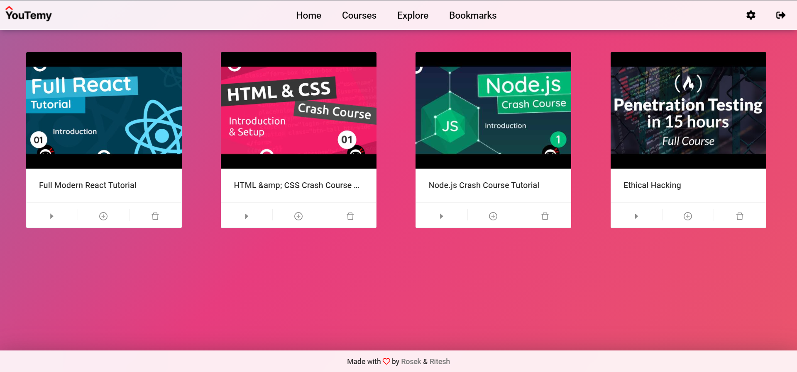
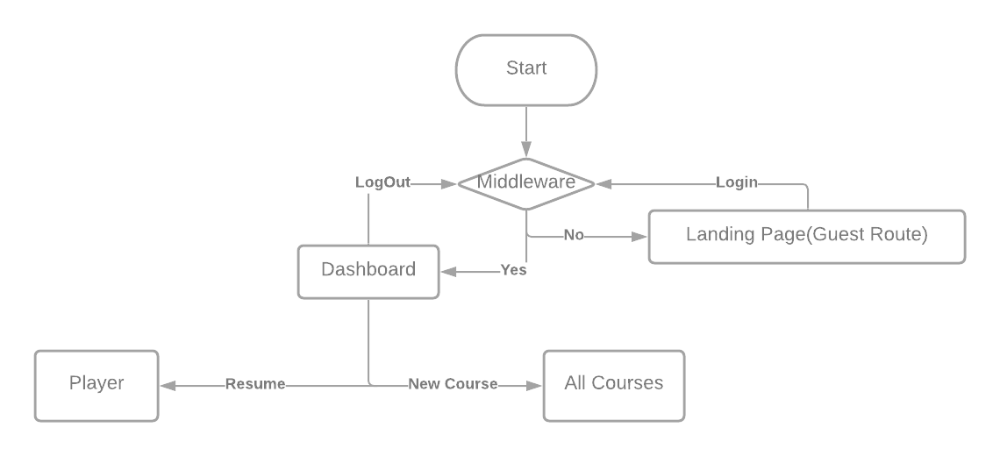
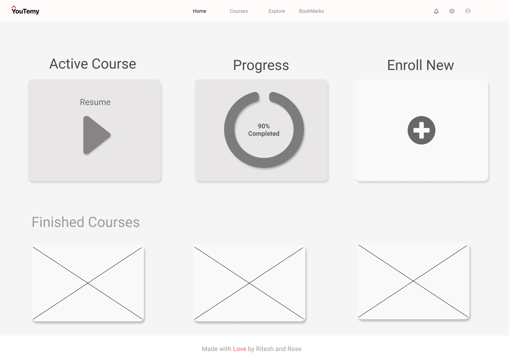
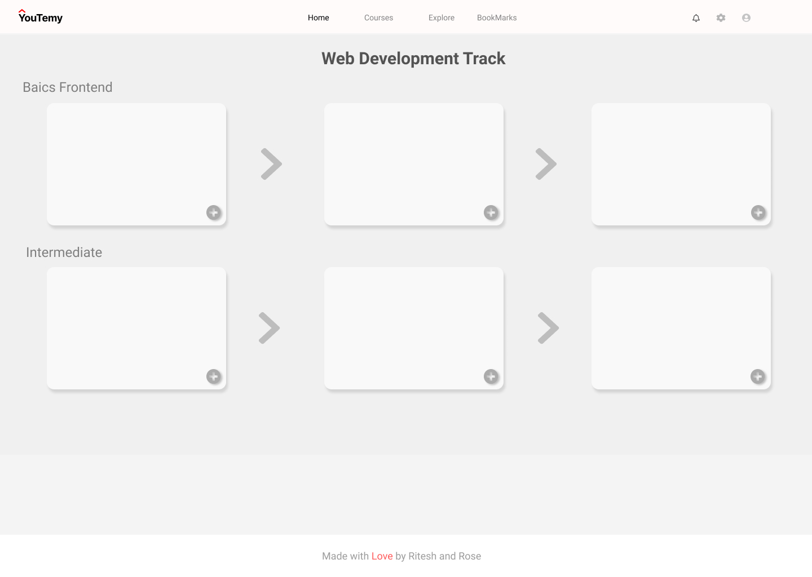
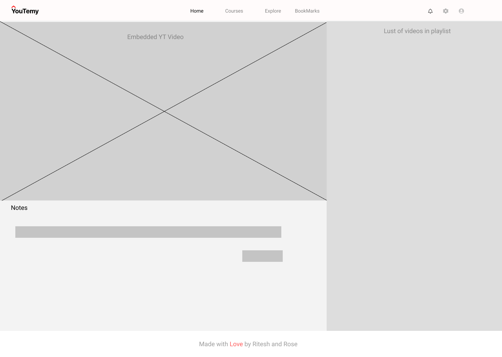

# Youtemy
A great way to learn from YouTube courses without any distractions and the ability to enroll in courses and track them with a daily streak to become more consistent.
 

## __Starting the Dev Server__

- Clone the repository to your local system. `https://github.com/rosekamallove/youtemy`

-  Firebase API Setup:

    1. Go to [Firebase Console](https://console.firebase.google.com) and follow the steps to create a new Firebase project.
    2. Select `</>` , *Add a project via Code*.

    3. Create a new web app using the steps provided on the console.

    4. You will recieve a firebasConfig object with the first paramter as API key. Copy it.

    5. After you get the Firebase API key, create a .env file in the root folder of the repository

    6. Insert the folowing snippet in the file

            REACT_APP_FIREBASE="API_KEY_HERE"
      
  - Youtube API Setup:
    1. Go to the following link and set up a new project from <https://console.cloud.google.com/apis/>

    2. Go the the project's dashboard and click on **Enable APIs and Services**

    3. Select **Youtube Data API v3**

    4. Click on Credentials to create new credentials for the API client

    5. Select API Key out of the 3 options available (API Key, OAuth Client ID, Service Key)

    6. A new API key will be generated. Copy it in the .env file.

                 REACT_APP_YOUTUBE="API_KEY_HERE"

  - Ensure that .env is added in .gitignore file.

  -  In the root folder and enter the following commands in the CLI
   
             npm i or yarn
             npm start or yarn start
  -  If you wish to contribute, either look for issues already created or create an issue if you have a new idea. 
 

> ## Snapshots of the Hosted Projects

> ### 

> ### 

> ### 

> ### 

> ### 

## Overview

- ### Pages:
    - **Landing Page** (Middleware goes here if not logged in)
      - LogIn or Contribute 
    - **Dashboard**:
        - Courses currently enrolled
        - Streak Tracker
            - Daily Goal (Progress)
        - All-time Progress (Across Courses)

    - **Course Curriculum**
        - Different Tracks
            - Web-Dev Track
                - HTML\CSS
                - JavaScript
                - React/Vue/Angular
                - Node.JS / Express

    - **User Dashboard**
        - Courses currently enrolled in
        - Charts for the progress
        - Tutorial Hell Warnings
        - Maybe percentile
        - Suggested next course

    - **Explore Page**
        - Search for new Courses on Youtube
        - Add them to bookmrks or enroll in them
        
     - **Settings**
        - Delete all Bookmarks
        - Delete all enrolled courses
<!-- 
### MVP Flow:
 -->

<!-- ### MVP Mockups:

**Navbar and Footer:**

**Dashboard:**

**Course Curriculam:**

**Video Player:**
 -->

